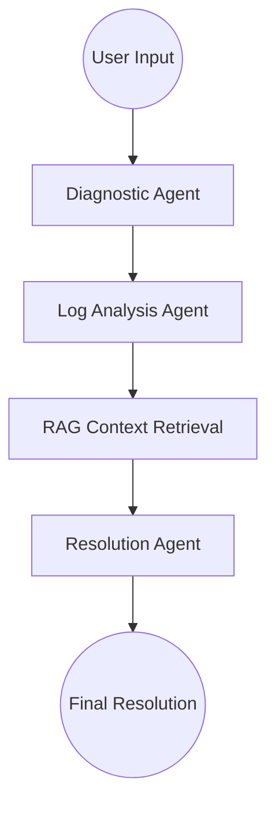

# 🏦 Multi-Agent Banking AI System (LangGraph + RAG + UI)

## 🚀 Overview
This project is a **production-style multi-agent AI system** designed to automate banking production support workflows using **LLMs, LangGraph, and Retrieval-Augmented Generation (RAG)**.

It simulates real-world **L1/L2 banking support operations**, enabling intelligent issue diagnosis, log analysis, and resolution recommendations using Google Gemini models.

---

## 🧠 Key Features

- 🤖 Multi-Agent Architecture (LangGraph)
- 🔍 RAG-based Context Retrieval (FAISS)
- 🧾 Intelligent Root Cause Analysis
- ⚡ Real-time Issue Processing
- 🖥️ Interactive UI (Streamlit)
- 🔗 API-ready backend design

---

## 🏗️ Architecture & Workflow

The system utilizes **LangGraph** to construct a stateful directed acyclic graph (DAG) of specialized AI agents. When a user submits a support issue, it flows through the following automated pipeline:



1. **Diagnostic Agent** (`diagnostic_agent.py`): 
   - **Role:** The entry point. 
   - **Action:** It analyzes the user's issue and identifies which core banking module is affected (e.g., Payments, General Ledger, Letters of Credit, Loans).
2. **Log Analysis Agent** (`log_agent.py`): 
   - **Role:** Technical Investigator. 
   - **Action:** Takes the output from the diagnostic agent and simulates checking application logs to identify technical anomalies or trace failures related to the issue.
3. **RAG Context Retrieval** (`Rag.py`): 
   - **Role:** Knowledge Base Search. 
   - **Action:** Uses FAISS and Google Generative AI embeddings (`gemini-embedding-2`) to search a local JSON knowledge base (`data/incidents.json`) for similar past incidents and their successful resolutions.
4. **Resolution Agent** (`resolution_agent.py`): 
   - **Role:** Final Decision Maker. 
   - **Action:** Consolidates the diagnostic report, the log analysis, and the historical RAG context to formulate a concrete root cause analysis and a step-by-step resolution plan for the user.

---

## 🦜🔗 How LangChain is Used

**LangChain** and its related ecosystem libraries form the backbone of this project:

- **The Multi-Agent Workflow (`graph.py`)**: Uses `langgraph.graph.StateGraph` to define a "state machine" that links the different Python agent functions together into a seamless workflow.
- **The AI Agents (`diagnostic_agent.py`, `log_agent.py`, `resolution_agent.py`)**: Uses `langchain_google_genai.ChatGoogleGenerativeAI` to standardize the LLM objects, making it incredibly easy to send prompt strings to the Gemini model and get responses via `llm.invoke(prompt).content`.
- **The RAG & Database System (`Rag.py`)**: 
  - Uses `langchain_google_genai.GoogleGenerativeAIEmbeddings` to effortlessly convert text in the JSON file into mathematical vector arrays.
  - Uses `langchain_community.vectorstores.FAISS` to load those vectors into an in-memory database (`FAISS.from_texts`).
  - Uses LangChain's `.similarity_search(query)` method to instantly find the closest matching historical issues.

---

## 🛠️ Setup & Execution

### Prerequisites
- `uv` package manager installed

### 1. Configure Environment
Ensure your `.env` file in the root directory contains your Google Gemini API Key:
```env
GEMINI_API_KEY="your_actual_api_key_here"
```

### 2. Install Dependencies
The project uses `uv` for lightning-fast dependency management:
```bash
uv sync
```

### 3. Run the Application
Launch the interactive Streamlit web interface:
```bash
uv run streamlit run streamlit_app.py
```
